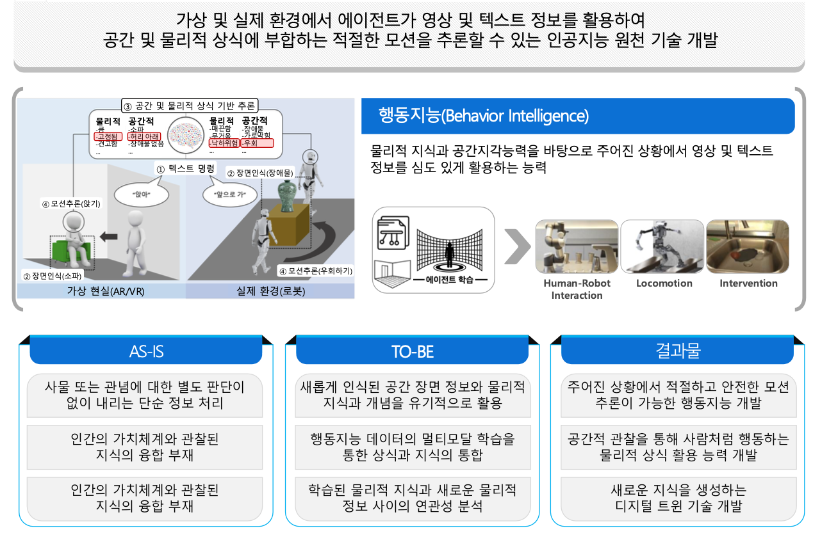
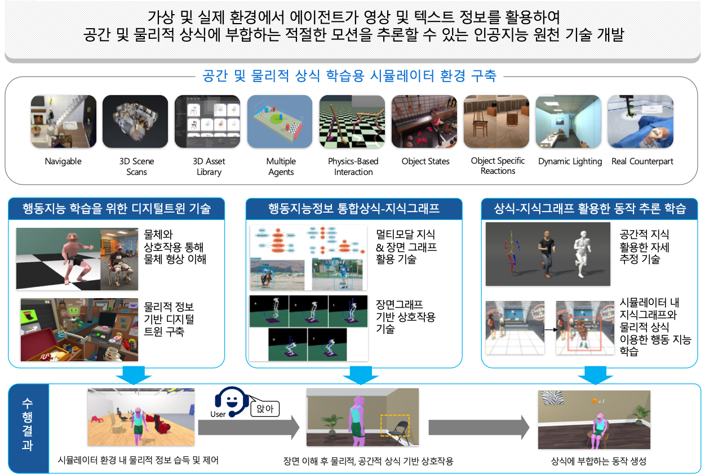

# Geometric and Physical Commonsense Reasoning based Behavior Intelligence for Embodied AI 
- Research Period: April 1, 2022 ~ December 31, 2026

## Consortium Collaborators
**Principal Investigator**
- [**Kyungdon Joo**](https://unist.info/) @ Ulsan National Institute of Science and Technology

**Collaborators**
- [**Sungbin Lim**](https://www.sungbin-lim.net/) @ Korea University
- [**Sungjoon Choi**](https://sites.google.com/view/sungjoon-choi/home) @ Korea University
- [**Eunsol Kim**](http://hyumllab.hanyang.ac.kr/) @ Hanyang University
- [**Beomjoon Kim**](https://beomjoonkim.github.io/) @ Korea Advanced Institute of Science and Technology 

## Publications
- **DITTO: Dual and Integrated Latent Topologies for Implicit 3D Reconstruction** (*CVPR 2024*)  
- **Fracture Assembly with Segmentation and Iterative Registration** (*ICASSP 2024*)   
- **ContactGen: Contact-Guided Interactive 3D Human Generation for Partners** (*AAAI 2024*)  
- **Compositional Video Understanding with Spatiotemporal Structure-based Transformers** (*CVPR 2024*)  
- **Structure-Aware Multimodal Sequential Learning for Visual Dialog** (*AAAI 2024*)  
- **Diffusion-based Signed Distance Fields for 3D Shape Generation** (*CVPR 2023*)  
- **Pose-guided 3D Human Generation in Indoor Scene** (*AAAI 2023*)  
- **An intuitive multi-frequency feature representation for SO (3)-equivariant networks** (*ICLR 2024*)  
- **CORN: Contact-based Object Representation for Nonprehensile Manipulation of General Unseen Objects** (*ICLR 2024*)  
- **수학적 증명을 위한 대규모 언어모델 프롬프팅(Large-Scale Language Model Prompting for Mathematical Proof)** (*KSC 2022*) 
- **대규모 언어모델을 이용한 상식 추론을 위한 지식 프롬프트 생성 방법(Knowledge Prompting Generation for Commonsense Reasoning with Large-Scale Language Models)** (*KSC 2022*) 
- **지식 기반 시각 질의 응답을 위한 문맥 사전 학습 방법(Contextualized Pre-training for Knowledge-aware Visual Question Answering)** (*KSC 2022*) 
- **의사 경계 기반 군집화를 통한 비지도 영상 경계 분할(Unsupervised Video Segmentation Using Pseudo-Boundary Clustering)** (*KSC 2022*) 
- **CORN: Contact-based Object Representation for Nonprehensile Manipulation of General Unseen Objects** (*ACCV 2022*)  

## Promotion
- TBD 

## Acknowledgement
This work was supported by Institute for Information & Communications Technology Promotion (IITP) grant funded by the Korea government (MSIT) [No. RS-2022-II220612, Geometric and Physical Commonsense Reasoning based Behavior Intelligence for Embodied AI].

## Contact information
If you have any inquiries, please contact **Kyungdon Joo** (vision3d-lab@unist.ac.kr).
